# Introduction to computing with Python for engineering and scientific applications

These Jupyter notebooks provide a self-study introduction to computing
with Python. They have been developed for the computing course in Part
IA (Michaelmas Term) of the Engineering Tripos at University of
Cambridge. This is a first computing course for undergraduate students.

The notebooks can be freely used, shared and modified. See the copyright
and license notice below.

# Note on GenAI

For these exercises the use of GenAI is *not permitted*.  To be able to code well requires and understanding of the fundamentals, which are based learnt by getting stuck and making mistakes.  If you need support: look at the content provided in these notebooks, [Python's documentation](https://docs.python.org/3/), reputible tutorials such as [W3 Schools](https://www.w3schools.com/python/), ask your friends and/or come to the Helpdesk (see Module for details).

# Where to Run

All computing exercises can be run in the DPO, for these exercises you need to boot into *Linux*.  If you have your own device, you are encouraged to follow the instructions below to install Python yourself - we can help you at the Helpdesk.  To mitigate against any issues you may have with your installation, ensure you leave enough time to complete the exercises in the DPO.

# How to Run

First time?  Skip to [Getting Set Up](#getting-set-up) below...
<details>
<summary>Open your Terminal</summary>

* Windows - in the application menu run "wsl"
* Linux/Mac - load your terminal program
</details>
<details>
<summary>Change directory to your project folder</summary>

```bash
    # nb change the location!
    cd PartIA-Computing-Michaelmas_CSRid
```
</details>
<details>
<summary>Activate your Python virtual environment</summary>

```bash
source venv/bin/activate
```
</details>
<details>
<summary>Launch jupyter-lab</summary>

```bash
jupyter-lab
```
</details>
<details>
<summary>Access your files</summary>

Copy the URL jupyter-lab shows and run it in a broswer.
</details>


# Getting Set Up
<details>
<summary>What is a Terminal/the Command Line?</summary>

You may be familiar with clicking buttons/icons within a Graphical User Interface (GUI).  It is powerful to be able to run programs (aka commands) whilst specifying options: this can be done by typing a command onto the command line (aka into the terminal) and then hitting "Enter"/"Return".

If you aren't familiar with the concept of the Command Line, please read [this tutorial](https://ubuntu.com/tutorials/command-line-for-beginners) - the concepts apply to all operating systems.  nb step 3 on Opening a terminal will vary if you aren't using Linux:
* in Mac you can just open a terminal
* in Windows, we need to install wsl first (see below)
</details>

#### Prerequisite - Command Line
<details>
<summary>DPO, Linux, MacOS</summary>

It's set up and ready to go!  Load a terminal.
</details>
<details>
<summary>Windows</summary>

We recommend using [WSL (Windows Subsystem for Linux)](https://learn.microsoft.com/en-us/windows/wsl/install).
During your future career as an engineer, you will need to be comfortable using a
Linux/Unix style terminal.  WSL allows you to do this from a Windows installation,
supported by Microsoft.
- In the Windows Search bar, search for "Turn Windows feature on or off" and open it.
- Enable the "Virtual Machine Platform" and "Windows Subsystem for Linux" (and, if present, "Hyper-V") boxes.
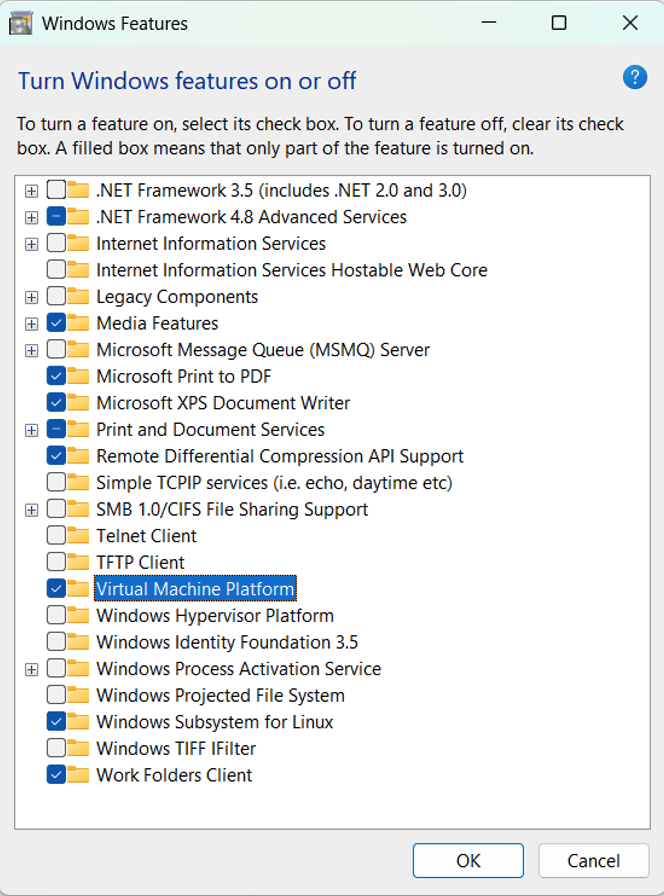
- Click OK and restart your PC when prompted.
- In the Windows search bad, search for ```cmd```, click “Run as administrator”
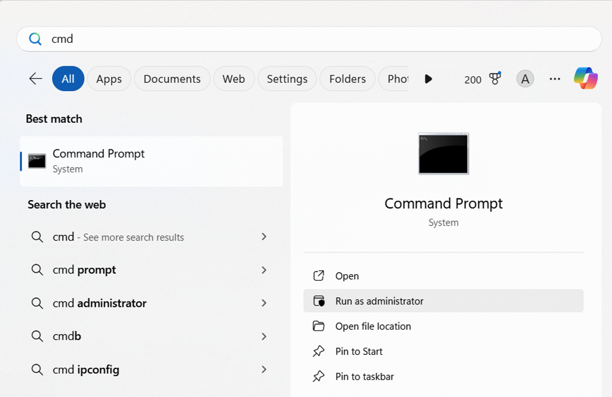
- Click “Yes”, when it checks this is ok
- Type in, then hit return:
    ```wsl --install```
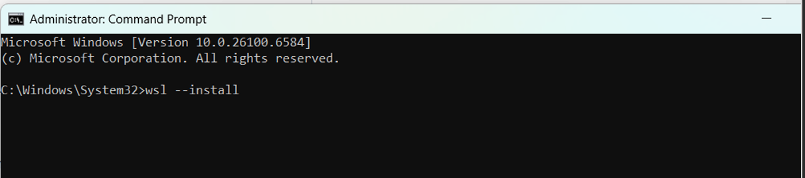
- Follow the on screen instructions to set up a username and a password.
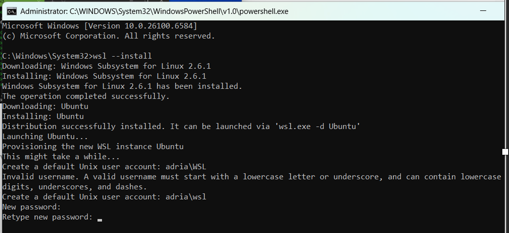
- Close the Windows command terminal.
- Launch a wsl terminal by typing ```wsl``` into the Windows search bar and run it (click "Open") (remember this step - you will run it everytime you need to start a new wsl terminal).
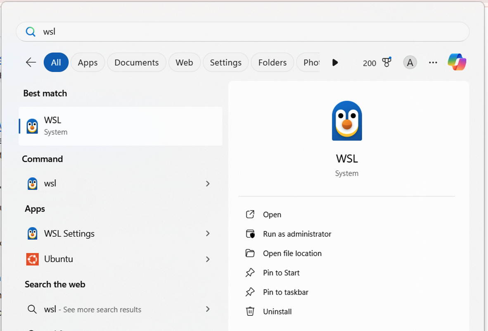
</details>

#### Prerequisite - Python
<details>
<summary>DPO</summary>

It's set up and ready to go!
</details>
<details>
<summary>Ubuntu</summary>

It’s fairly likely you will already have Python installed, but it might only have the command python3 available.  In order to allow python3 venv’s and alias python to python3, a full set of packages to install might be: ```sudo apt install python3 python3-venv python-is-python3```
</details>
<details>
<summary>MacOS</summary>

* Python maybe already installed, try running ```python```.  If not:
* Install Homebrew: https://brew.sh/
* Run:
    ```brew install python```
</details>
<details>
<summary>Windows</summary>

* To install the relevant dependencies, copy/paste and hit7 return:
    ```bash
    sudo apt-get update
    sudo apt-get install python3 python3-venv python-is-python3 python3-pip
    ```
    *nb* the last command will install a lot of dependencies.  Confirm by hitting return ([Y/n] means enter "y" for "yes" and "n" for "no", with "Y"=yes as the default answer.)
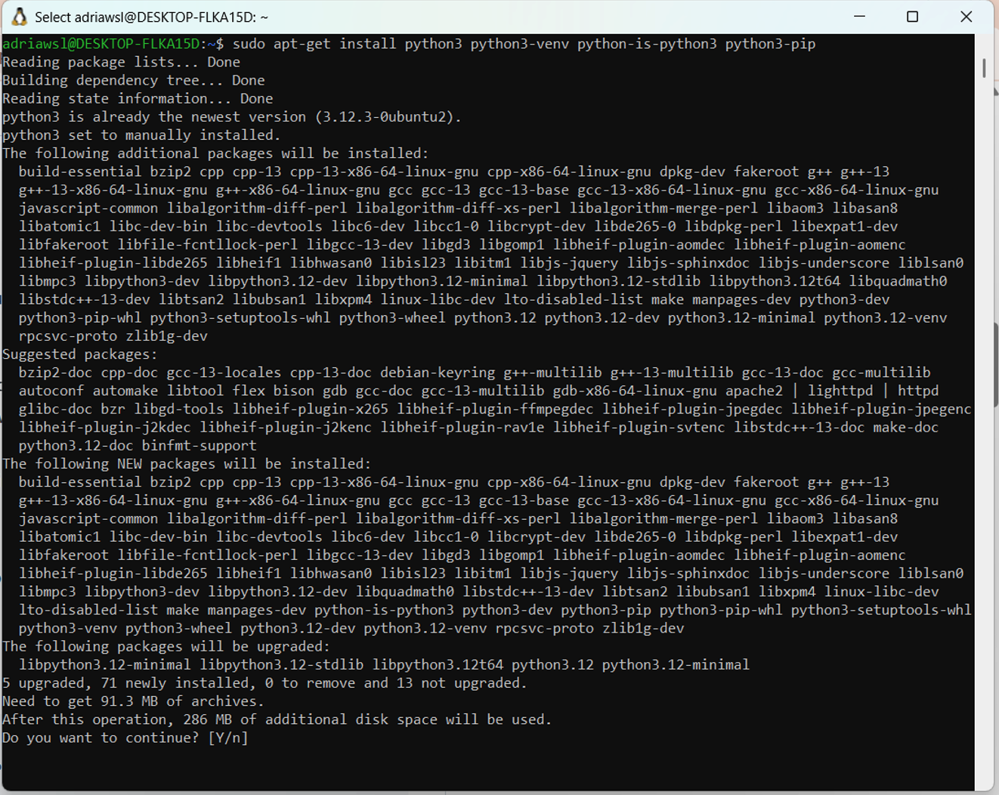
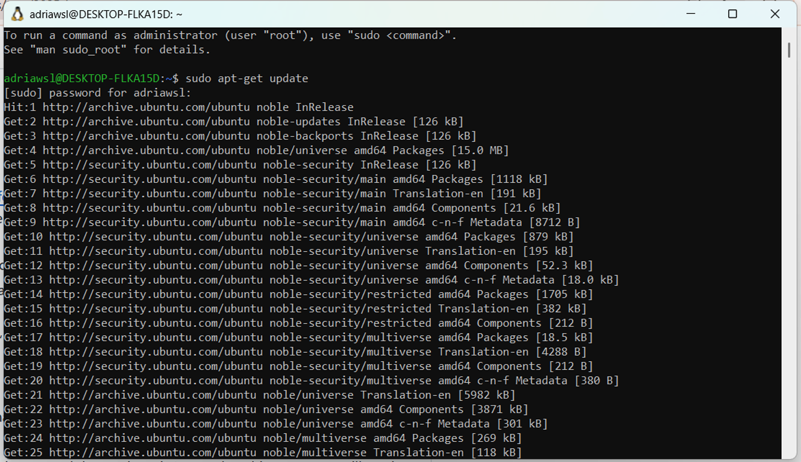
</details>

#### Pre-requisite - Git
<details>
<summary>DPO, Linux, WSL</summary>

It's set up and ready to go!
</details>
<details>
<summary>MacOS</summary>


* (Requires Homebrew, see under Python above.)  Run:
    ```brew install git```
</details>

#### Setting up GitHub

<details>
<summary>Make a GitHub account</summary>

You will need to use git to obtain the relevant notebooks.  You will use git very often going forwards, this is a good time to learn how to use it!  For this course, get into the habit of saving your notebook and _pushing_ the change.

Make an account on [GitHub](https://github.com/), perhaps using your CRSid as a username.
</details>

##### Either use a Personal Access Token or use SSH keys (you can change your mind later):
<details>
<summary>Option 1. Using Personal Access Tokens (HTTPS Authentication)</summary>

If you are using the HTTPS method, GitHub no longer accepts your regular password.
Instead, you need to use a **Personal Access Token (PAT)** as your password.

To generate a PAT:
1. In the upper-right corner of any page on GitHub, click your profile picture, then click  Settings.
2. Click **Developer settings**:
   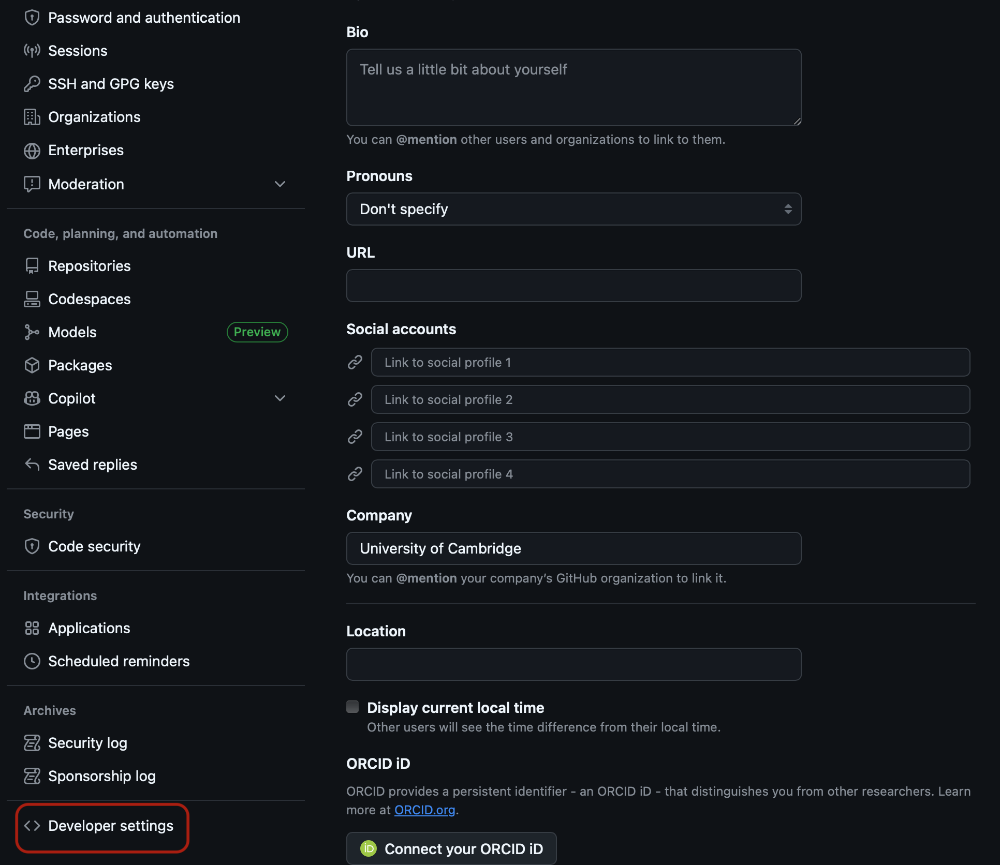
3. Choose **Personal access tokens → Tokens (classic)**, then click **Generate new token (classic)**:
   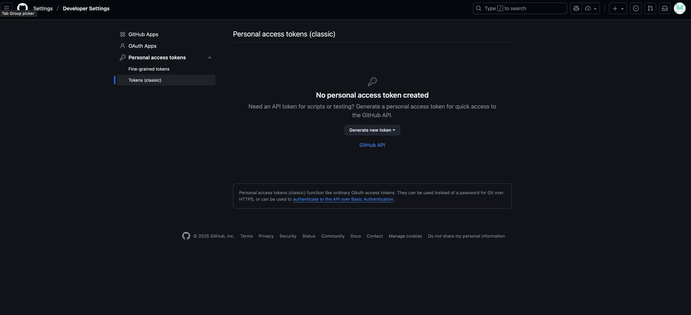
4. Check **all items** (scopes) to grant full access:
   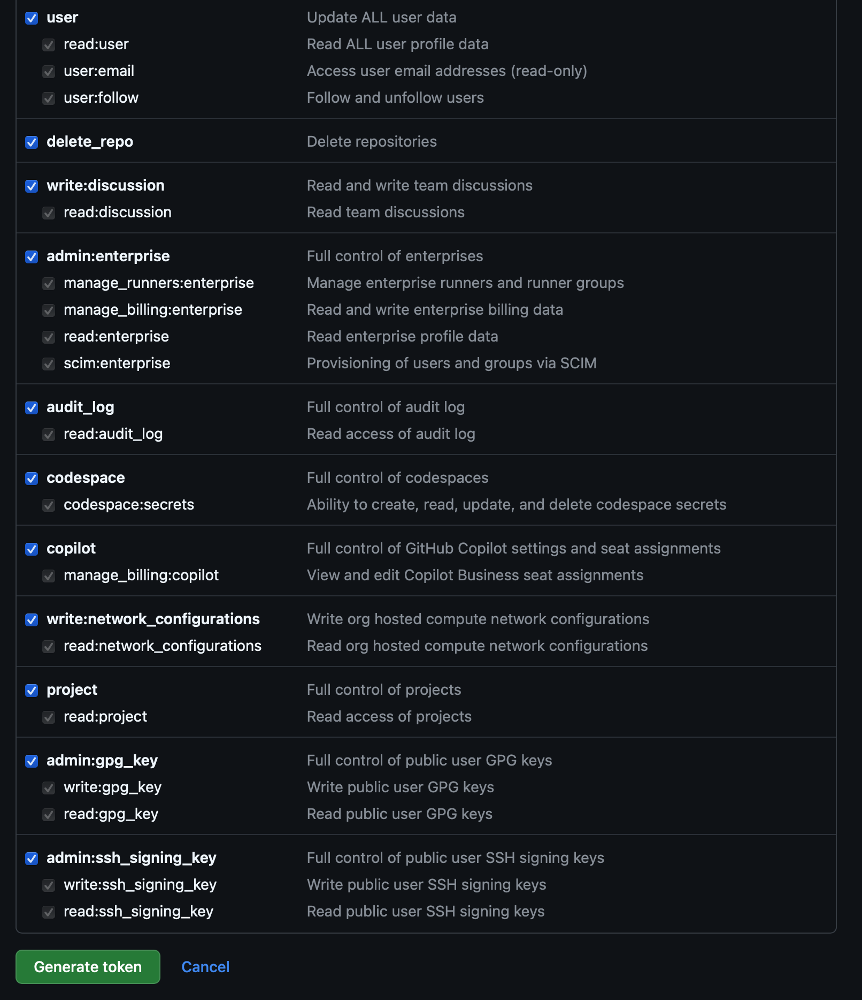
5. After creating the token, make sure to **copy it immediately** — GitHub will not show it again:
   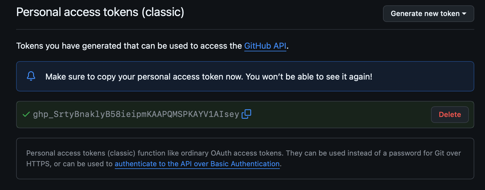

When prompted for credentials during `git push`:
* **Username:** your GitHub username
* **Password:** the **Personal Access Token (PAT)** you just created
</details>
<details>
<summary>Option 2. Use SSH Keys</summary>

SSH keys allow remote, encrypted authentication directly between your machine and a server.

To create and upload SSH keys:
* Create a SSH key pair (changing the email address):
    ```bash
    ssh-keygen -t ed25519 -C "your_email@example.com"
    ```
    You hit ENTER for each question - default file location and empty passphrase (unless you want one)
* Upload the SSH *public (only)* key to GitHub:
    * Copy the SSH public key to your clipboard, either by opening the .pub file just created above and copying the contents to the clipboard, or from the terminal:
        ```bash
        pbcopy < ~/.ssh/id_ed25519.pub
        ```
    * In the upper-right corner of any page on GitHub, click your profile picture, then click  Settings.
    * In the "Access" section of the sidebar, click  SSH and GPG keys.
    * Click New SSH key or Add SSH key.
    * In the "Title" field, add a descriptive label for the new key. For example, if you're using a personal laptop, you might call this key "Personal laptop".
    * Set the "Key type" field to "Authentication Key".
    * In the "Key" field, paste your public key.
    * "Click Add SSH key"
</details>

#### Learn About Git

Read and bookark this tutorial for git: https://www.w3schools.com/git/default.asp?remote=github

#### Get the Notebooks
<details>
<summary>Make your own private copy of the notebooks</summary>

You will need to make your own *private* copy of the notebooks, by following these instructions *once*:
- Create a new repo and mark it *private*: https://github.com/new
    e.g. named PartIA-Computing-Michaelmas_CSRid (replacing the CRSid with yours.)
- Clone the code locally:
    ```bash
    git clone --bare https://github.com/CambridgeEngineering/PartIA-Computing-Michaelmas
    ```
- Push a copy of this repo to your private repo:
    ```bash
    cd PartIA-Computing-Michaelmas.git
    ```
    - If you set up ssh-keys (changing _username_ and _CSRid_):
        ```bash
        git push --mirror git@github.com:username/PartIA-Computing-Michaelmas_CSRid
        ```
    - Otherwise (changing _username_ and _CSRid_):
        ```bash
        git push --mirror https://github.com/username/PartIA-Computing-Michaelmas_CSRid
        ```
- Remove the original version to avoid confusion:
    ```bash
    cd ..
    rm -rf PartIA-Computing-Michaelmas.git
    ```
- _Clone_ your private copy on whichever device you need it (e.g. once in the DPO and once on your laptop/college PC), as follows:
    - If you set up ssh-keys (changing _username_ and _CSRid_):
        ```bash
        git clone git@github.com:username/PartIA-Computing-Michaelmas_CSRid
        ```
    - Otherwise (changing _username_ and _CSRid_):
        ```bash
        git clone https://github.com/username/PartIA-Computing-Michaelmas_CSRid
        ```
</details>

#### Get to the Correct File Location
<details>
<summary>Change to the correct directory</summary>

Now and each time you start a new terminal, you will need to change to the directory containing your code, e.g. (changing _CSRid_):
```bash
cd PartIA-Computing-Michaelmas_CSRid
```
</details>

#### Python Virtual Environment

<details>
<summary>What is a Python Virtual Environment?</summary>

A Python virtual environment, using the venv module, is a lightweight, compartmentalised Python environment with its own independent set of packages.  It can be useful in environments whereby you don’t have the ability or desire to add packages globally (e.g. where you might need root access) or for testing to check you have correctly listed your dependencies.
</details>
<details>
<summary>Create a virtual environment</summary>

Do this once per project space:
```bash
python -m venv venv
```
*nb* The second "venv" is the name of the venv, it can be whatever you like
</details>
<details>
<summary>Activate the virtual environment</summary>

Do this every time you need to use the venv):
```bash
source venv/bin/activate
```
*nb* where "venv" is the name of the venv you chose above.
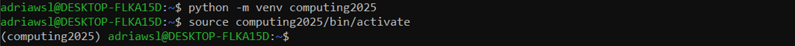

Note you should see ```(venv)``` (where venv is the name you chose) to the left of your command prompt, so you know your venv has been activated.
</details>

#### Python Requirements:
<details>
<summary>Install the Python requirements</summary>

You will need several Python packages installed.  You can use pip to achieve this within you're virtual environment:
```bash
pip install jupyterlab matplotlib numpy python-dateutil ipywidgets scipy numba requests pytest flake8
```
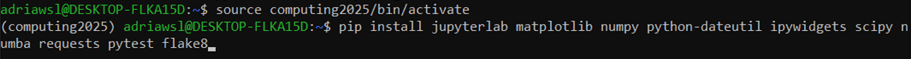
</details>

#### Launch Jupyter Lab
<details>
<summary>Launch Jupyter Lab</summary>

Within your Python virtual environment:
```bash
jupyter-lab
```
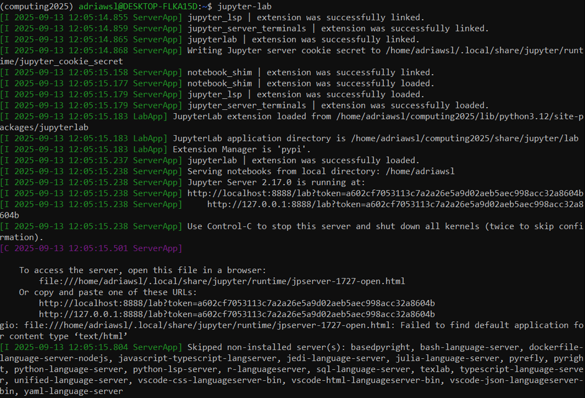

Note the output log, it'll give you a locally hosted web address to load in your browser (on some systems it will open the browser for you automatically).

Under "Notebook" click "Python 3 (ipykernel)", then from the file browser on the left, find the .ipynb file you'd like to work with.  Remember to keep saving your changes and then commit and push them to git ("git push" in a command line).
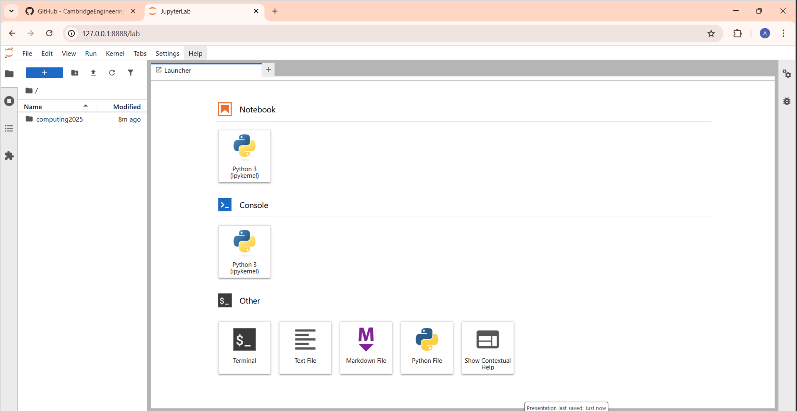
</details>

# Getting Started

Each notebook covers a topic, with a number of exercises for completion
at the end of each notebook. Start with the notebook 00 Part IA Michaelmas
Term computing. Model solutions to the exercises are available - contact [Flavia Mancini](<fm456@cam.ac.uk>) and [Jon Bonsor-Matthews](<jpm66@cam.ac.uk>) to request the solutions.


## Accompanying exercises

For each notebook there are a set of exercises in the directory
[Exercises](./Exercises/) for completion at end the of each Activity
notebook.


## Feedback and corrections

These notebooks are maintained at
https://github.com/CambridgeEngineering/PartIA-Computing-Michaelmas.
Please report suggestions or errors at:

https://github.com/CambridgeEngineering/PartIA-Computing-Michaelmas/issues


# Author and Maintainer

These notebooks were developed by Garth N. Wells and are maintained by Jon Bonsor-Matthews (jpm66).


# Acknowledgements

Valuable feedback during the development of the notebooks was provided
by Quang T. Ha, Hugo Hadfield, Tim Love, Chris Richardson and Joanna
Stadnik.


# License and copyright

All material is copyright of Garth N. Wells (<gnw20@cam.ac.uk>).

All text is made available under the Creative Commons
Attribution-ShareAlike 4.0 International Public License
(https://creativecommons.org/licenses/by-sa/4.0/legalcode).

All computer code is released under the MIT license.

The MIT License (MIT)
Copyright (c) 2016-2022 Garth N. Wells

Permission is hereby granted, free of charge, to any person obtaining
a copy of this software and associated documentation files (the
"Software"), to deal in the Software without restriction, including
without limitation the rights to use, copy, modify, merge, publish,
distribute, sublicense, and/or sell copies of the Software, and to
permit persons to whom the Software is furnished to do so, subject to
the following conditions:

The above copyright notice and this permission notice shall be
included in all copies or substantial portions of the Software.

THE SOFTWARE IS PROVIDED "AS IS", WITHOUT WARRANTY OF ANY KIND,
EXPRESS OR IMPLIED, INCLUDING BUT NOT LIMITED TO THE WARRANTIES OF
MERCHANTABILITY, FITNESS FOR A PARTICULAR PURPOSE AND
NONINFRINGEMENT. IN NO EVENT SHALL THE AUTHORS OR COPYRIGHT HOLDERS BE
LIABLE FOR ANY CLAIM, DAMAGES OR OTHER LIABILITY, WHETHER IN AN ACTION
OF CONTRACT, TORT OR OTHERWISE, ARISING FROM, OUT OF OR IN CONNECTION
WITH THE SOFTWARE OR THE USE OR OTHER DEALINGS IN THE SOFTWARE.
